# PracCodes
Repository for mathematical codes ( 2 variants - optimized, non-optimized )

- [Overview (NON OPTIMIZED)](INFO/NOptimized.md#overview)
    - [Table of Contents (NON OPTIMIZED)](INFO/NOptimized.md#table-of-content-non-optimized-python-version)
- [Optimized Experimental (build) ](INFO/Optimized.md#optimized-experimental)
    - [Overview (OPTIMIZED)](INFO/Optimized.md#overview-optimiezed)
    - [Table of Contents (OPTIMIZED)](INFO/Optimized.md#table-of-content-optimized) still in development
    - [API](INFO/Optimized.md#api)
        - [Current Api Support](INFO/Optimized.md#current-api-support)
- [Last Update](#last-update)


---
## Last Update

#### Update 28.09.2024 INFO:

- `optimized.lineq.lineq_sub`.
    - development started.
    - add functions for linear equations systems:
        -  `solve_tridiagonal(matrix, vector)`:
            ```
            Solve a system of linear equations with tridiagonal matrix
            ``` 
            Matrix must be tridiagonal: 
            | | | | | | | |
            | --- | --- | --- | --- | --- | --- | --- | 
            | $a_{11}$ | $b_{12}$ | 0 | ... | ... | ... | 0 
            | $c_{21}$ | $a_{22}$ | $b_{23}$ | ... | ... | ... | 0
            | 0 | $c_{32}$ | $a_{33}$ | $b_{34}$ | ... | ... | 0
            | ... | 0 | $c_{43}$ | $a_{44}$ | $b_{45}$ | ... | 0
            | ... | ... | ... | ... | ... | ... | 0 | 
            | 0 | 0 | ... | 0| $c_{n-1 \ n-2}$ | $a_{n-1 \ n-1}$ | $b_{n-1 \ n}$ | 
            | 0   |  0  | ...   | 0 | 0 | $c_{n \ n-1}$ | $a_{nn}$ |

            [Tridiagonal matrix algorithm (Thomas algorithm)](https://en.wikipedia.org/wiki/Tridiagonal_matrix_algorithm)
        -  `solve_gauss(matrix, vector)`:
            ```
            Solve a system of linear equations with gauss method
            ```
            [Gaussian elimination](https://en.wikipedia.org/wiki/Gaussian_elimination)

        -  `solve_lu(matrix, vector)`:
            ```
            Solve a system of linear equations with LU method
            ```
            $$
            \begin{aligned}
            (1) \ & A\cdot\bar{x} = \bar{b} \\
            (2) \ & A = L \cdot U  \\ 
            (3) \ & L \cdot U = A \\
            (4) \ & U \cdot \bar{x} = \bar{y}\\
            (5) \ & L \cdot \bar{y} = \bar{b} \\
            (6) \ & L \text{ is a lower triangular matrix, so (5) is easy to solve for } \bar{y} \\
            (7) \ & U \text{ is an upper triangular matrix, so (4) is easy to solve for } \bar{x}
            \end{aligned}
            \\
            \\
            \begin{aligned}
            \text{Algorithm complexity:}
            \\ LU_{\text{complexity}} & = \frac{2 \cdot n^3}{3} + O(n^2) \\
            \text{Solving (5) and (4)} & : n^2 + O(n)
            \end{aligned}
            $$


#### UPDATE 01.09.2024 INFO:
- `run_api.py` updated.
    - Argparser added.

> [!TIP]
> **usage: optimized_api [-h] [-r]**
>
> `optimized_api FLASK app`
>
> *options*: 
>
>  -h, --help          show this help message and exit \
>  -r, --rebuild, -re  Rebuild optimized_api 

---
#### UPDATE #2 23.08.2024 INFO:
- GUI updated.
    - Add dark mode.
    - Add new `accordion` fields.
    - Add new `input` fields.
    - Add `result copy` button.
    - Add `global_info` and `global_info.GlobalRet` return fields.
    - Add new styles to `statics`.
    - Add new `.js` files to `statics`.

> [!NOTE]  
> api_key in [config.ini](optimized/optimized_api/static/config.ini) does not work. 

- Enjoy 😸


#### UPDATE 23.08.2024 INFO:
- Started creating GUI for API. Now you can use only lineq.generator GUI.
- GUI __LOCAL__ link -> localhost:8000/main (localhost:8000/ works too (without GUI)) after running `run_api.py`.
- Examples -> [images.api_gui](images/api_gui/)

    [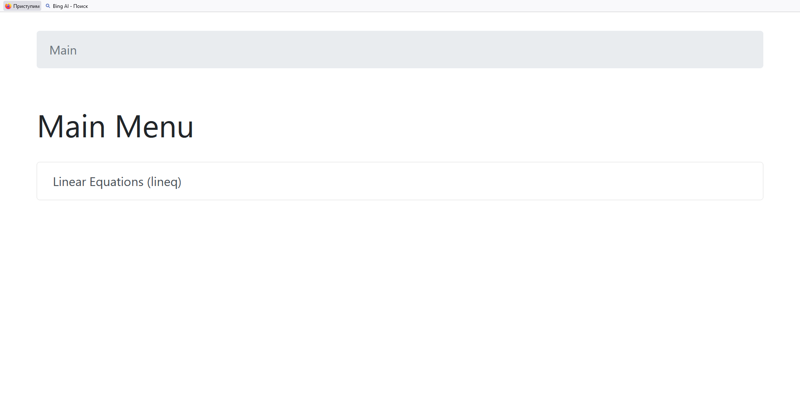]
    [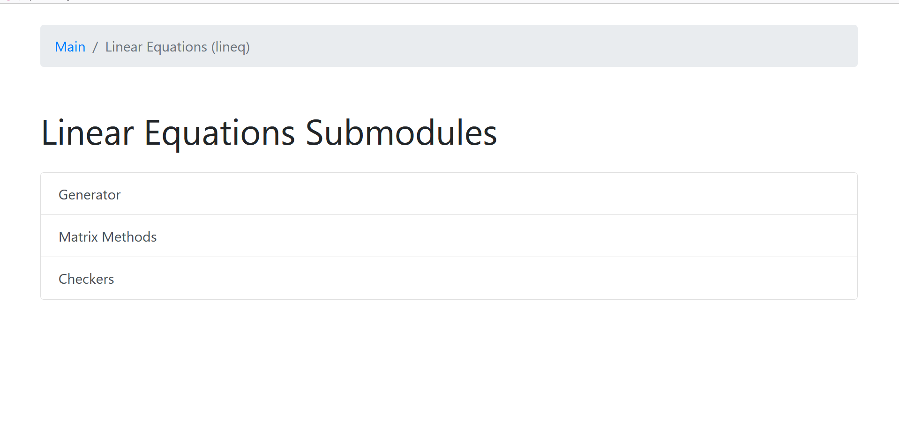]
    [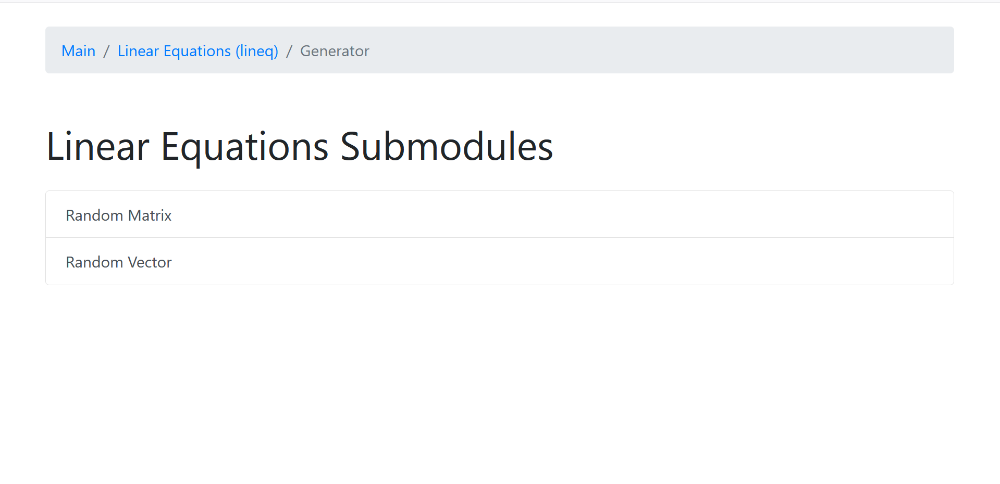]

    [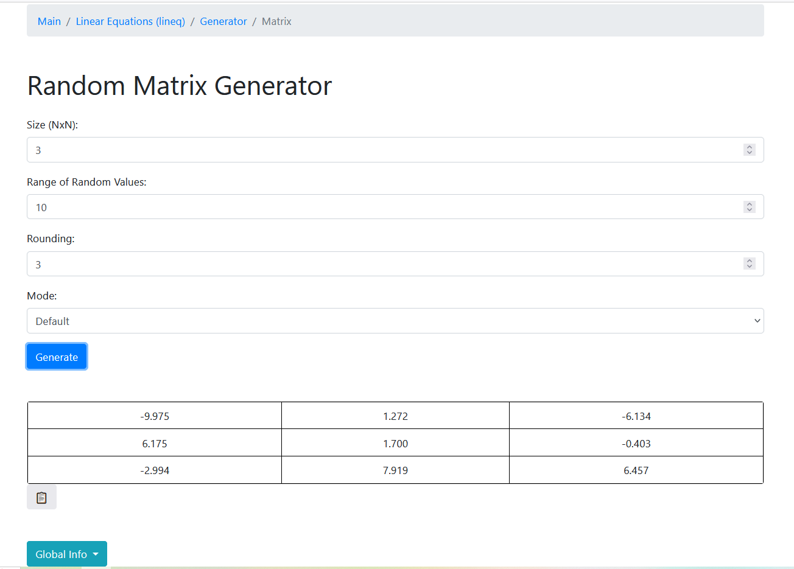]
    [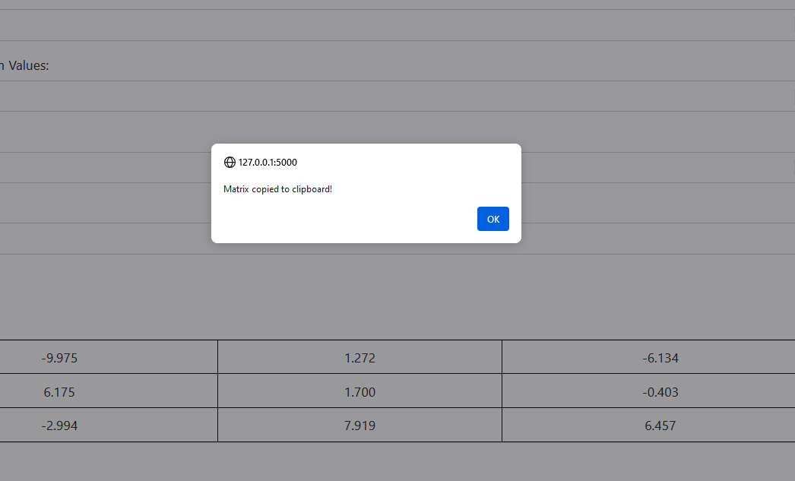]
    [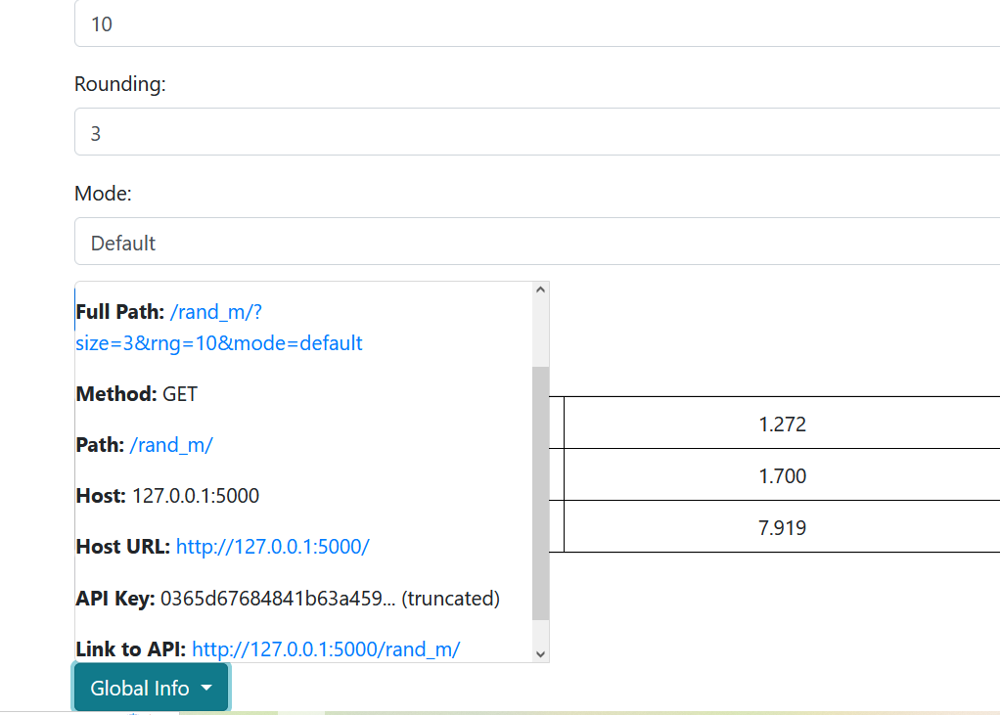]


---
#### Update 22.08.2024 INFO:
- [optimized.lineq.matrix_methods.python_interface-API](optimized/lineq/matrix_methods/Module/module.py) is ready for 100% use.
- [optimized.lineq.generator.python_interface-API](optimized/lineq/generator/Module/generator.py) is ready for 100% use.
- [optimized.lineq.checker.python_interface-API](optimized/lineq/checker/Module/checker.py) is ready for 100% use.
    - all API functions you can see in [Current Api Support](INFO/Optimized.md#current-api-support)
        
---
#### Update 19.08.2024 INFO:

- Continued working on API after a break. API for generator, checker will be finished soon. Then I will continue optimizing the rest of the modules, namely [lineq.lineq](Lineq/LinEq/lineq.py), ( [lineq.Utils.Prettier](Lineq/LinEq/Utils/Prettier.py), [lineq.Utils.S_R](Lineq/LinEq/Utils/S_R.py) may not be changed, but will be moved to a new module without optimization, or will be completely removed ). [lineq.Utils.timer](Lineq/LinEq/Utils/timer.py) will be definitely removed.

- `optimized.lineq.matrix_methods.python_interface API` is ready for 100% use.
    - all API functions you can see in [Current Api Support](INFO/Optimized.md#current-api-support)

---
#### Update 10.08.2024 INFO:

- Fixed a bug in the `rand` function of the `optimized/lineq/matrix_methods/lowlevel/mm.c` file ([file](optimized/lineq/matrix_methods/lowlevel/mm.c)). *The function was returning extremely large numbers instead of a random number within the specified range.*
- Updated the docstrings in the `optimized.lineq.generator.python_interface` module. [optimized.lineq.generator.python_interface](optimized/lineq/generator/Module/generator.py)
- Added new information to the `API data.json` file. [API-DATA](optimized/optimized_api/static/data.json).
- Added new API functions. Check the [Current Api Support](#current-api-support) for all functions.
- New API return system -> Added in each return global_info -> request.headers, host, url, etc...
    - some screenshots

    [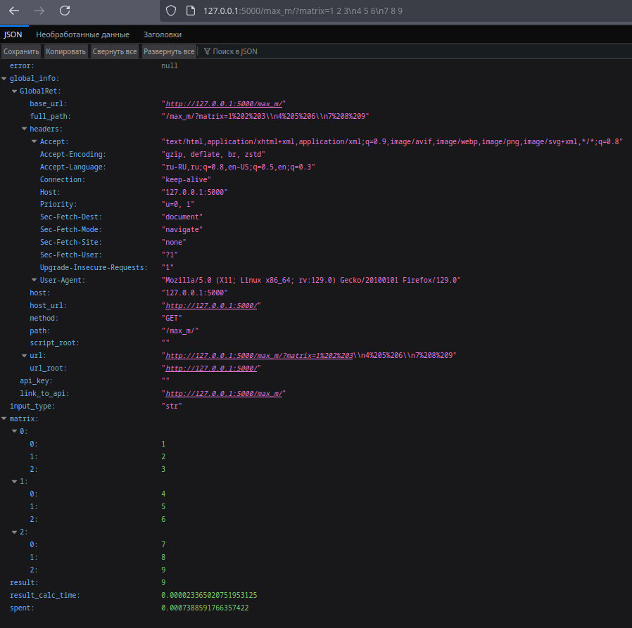](images/im1example_api_new.png)
    [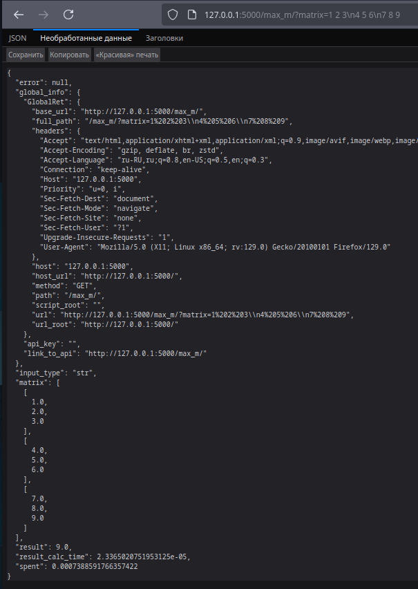](images/im2example_api_new.png)
    [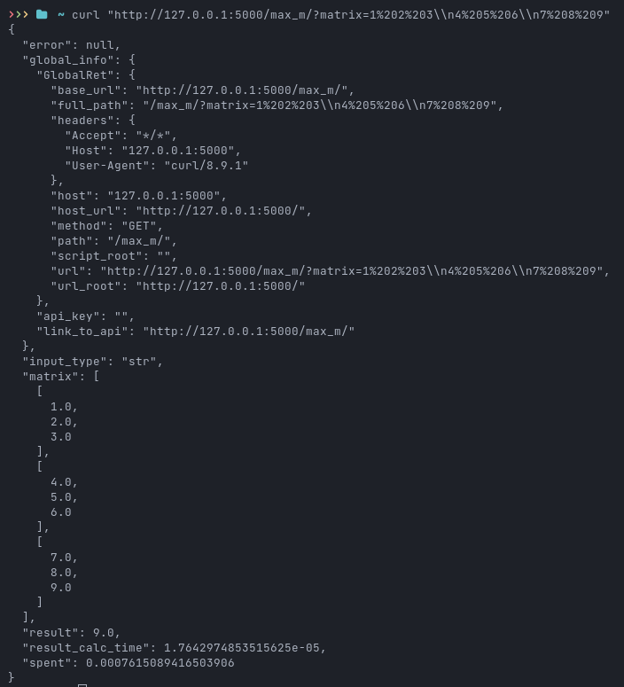](images/im3example_api_new.png)

---
#### Update #2 04.08.2024 INFO:
Add new API functions
[Current Api Support](INFO/Optimized.md#current-api-support)
Check usage instructions in [API-DATA](optimized/optimized_api/static/data.json) or just run [run_api.py](run_api.py) and check home page.
All info in:

- [API](#api)
    - [Current Api Support](INFO/Optimized.md#current-api-support)


#### Update 04.08.2024 INFO:
Started developing the [API](optimized/optimized_api/) for the optimized codes. Already ready for use determinant function API. 
Info in [data](optimized/optimized_api/static/data.json). To run the API, run [run_api](run_api.py). Local API is available at [http://127.0.0.1:8000/](http://127.0.0.1:8000/). 
- Use examples: 
    - browser list mode `(img1)`: **`http://127.0.0.1:5000/det/?type=list&matrix=[[1,2,3],[4,5,6],[7,1.2,7]]`**
    
    
    - browser str mode `(img2)`: **`http://127.0.0.1:5000/det/?matrix=1%202%203\n4%205%206\n7%208%209`**
    - curl list mode `(img3)`: 
    ```shell
    curl `http://127.0.0.1:5000/det/?type=list&matrix=%5B%5B1%2C2%2C3%5D%2C%5B4%2C5%2C6%5D%2C%5B7%2C1.2%2C7%5D%5D`
    ```
    
    [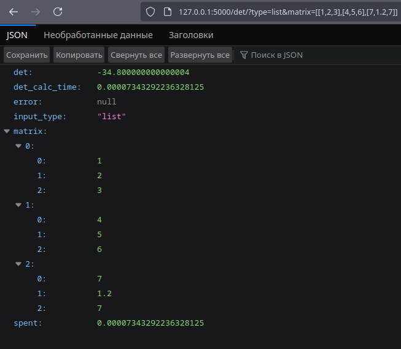](images/img_api_lm.png)
    [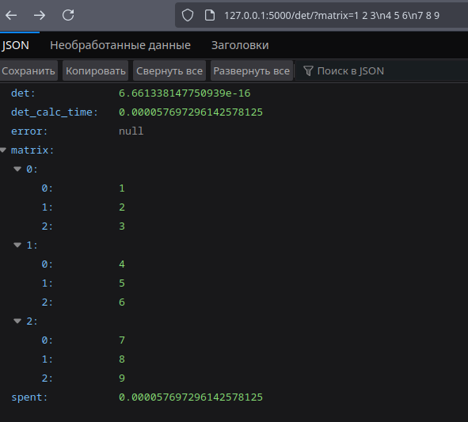](images/img_api_sm.png)
    [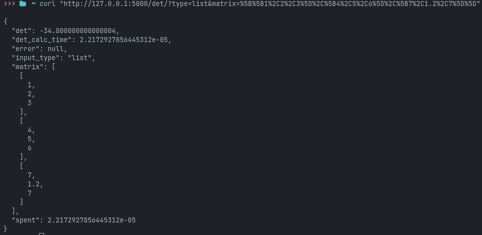](images/img_api_cm.png)
    

---
#### Update 02.08.2024 INFO:

Rewritted [build.py](optimized/build.py) script.

**`New Build System`**

* **Build Management:** Manages cleaning up previous builds, compiling modules, and organizing build artifacts.
* **Dependency Check:** Automatically checks for and installs necessary dependencies such as Cython.
* **Configuration Loading:** Loads build settings and module configurations from the file [cfg](optimized/build_cfg/build_modules.json). If the file does not exist, a default configuration is created.
* **Build Result Visualization:** Displays a tree structure with icons indicating the success or failure of each module.
* **Automated Testing:** Runs tests on successfully built libraries to ensure their correctness.

---
#### Update 29.07.2024 INFO:

I have rewritten the `Checker` module and updated matrix filling in `matrix_methods` module.

- Introduced the Checker class for matrix validation
  - Methods included:
    - diagonal_domination(matrix) -> bool: Checks matrix diagonal domination
    - symmetric_check(matrix) -> bool: Checks matrix symmetry
    - sylvesters_criterion(matrix) -> bool: Checks matrix against Sylvester's criterion

- I also updated the matrix filling in both the `matrix_methods` and `Checker` modules. I replaced the cycle with a for loop and used `memset(*, 0, sizeof(*))` to set the matrix elements to zero.

---

#### Update 26.07.2024 INFO:
The updated Python interface for [optimized.lineq.matrix_methods](optimized/lineq/matrix_methods/) is now ready for use. It is optimized for 100% efficiency.

The new code is significantly faster, with an average improvement of more than 50 times.

The [Generator](optimized/lineq/generator/) has also been rewritten. 

---

#### Update 26.07.2024 INFO:

In the `lineq/LinEq/Utils/Matrix_methods.py` file, the **`determinant`** function has been fixed.

I have started rewriting the code. In the `Optimized-Experimental` directory, you will find experimental versions of the codes with optimizations. These versions are about 50 times faster. **However, you need the Cython library for this!**

I have rewritten the `lineq.matrix_methods` module in the `optimized/lineq/matrix_methods/` directory.

Here are the links to the source code:

- The C code can be found in the [code](optimized/lineq/matrix_methods/lowlevel/mm.c) file.
- The Python code is available in the [code](optimized/lineq/matrix_methods/Module/module.py) file. This file is ready for 50% use. All functions work if imported from the `build.matrix_methods` file. However, in the Python file, only 50% of the code is implemented.

The source codes are located in the `optimized/{module_name}/{util_name}/lowlevel` directory, where {module_name} represents the module name and {util_name} represents the utility name.

To build the optimized version, run the ~~`build.bat`~~ **`[DELETED, use python script]`**[UPD 02.08.2024](#update-02082024-info) `build.py` file from the `optimized` directory. Please note that this feature does not work with older versions of the project. Wait for a new version to be ready with all optimizations implemented.  


